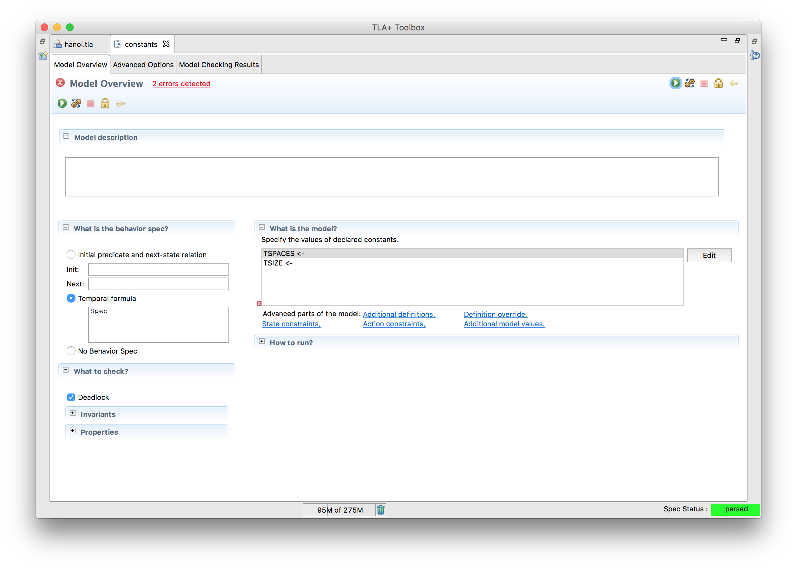
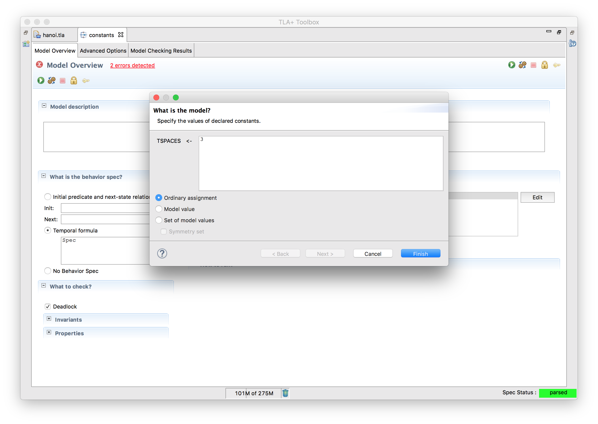
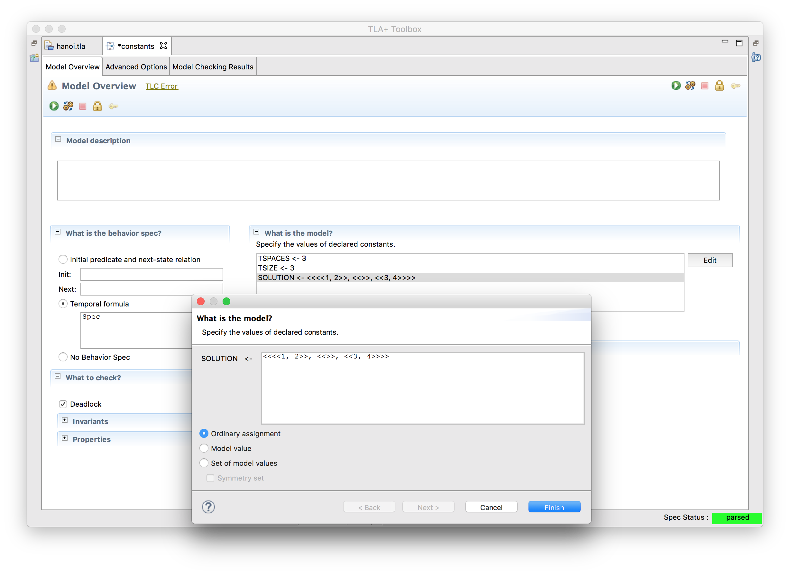

+++
title = "Constants"
weight = 5
+++

Let's go back to our old Hanoi solver. As a refresher, this is the code we started with.

{}

It works, but what if we wanted to change one of the parameters (more towers, more disks in a tower), we'd have to directly edit the code. It would be better to make a generic spec and test different parameters in the models instead. To do this, we introduce _constants_.

{}

This is the same as the old code, except that we now define the tower in terms of constants. Instead of the spec assigning the constant a value, the model does instead.



When we click edit we can assign a specific value to each constant.




### Assumptions

What if we also wanted to vary the solution? For example, we all know that it's possible to move the entire tower over. But is it possible to reach `<<<<1, 2>>, <<>>, <<3, 4>>>>`? By moving the solution to a constant, we can vary that in the model, too:

``` tla
CONSTANT SOLUTION
\* ...
assert tower /= SOLUTION
```

And now we can put the new solution in an ordinary assignment:



One problem: this solution is nonsensical. It has four numbers when `TSIZE` is 3. In these cases, TLA+ can't find a solution because the solution isn't even defined! One way to catch this kind of error is with an `ASSUME` statement:

{}

TLC will check that our assignments don't break any of the `ASSUME` expressions, so we can use `ASSUME` to make sure nobody makes a bad model. Of course, it can only check what we remember to check: for example, a solution with two "5"s can still slip through. As always, with programming, be paranoid.
