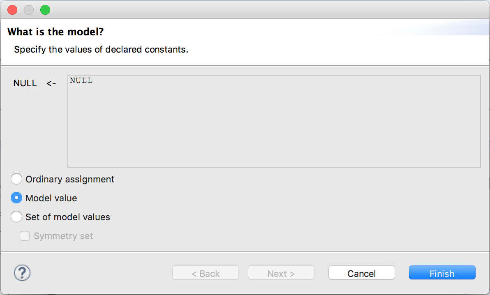

+++
title = "Model Values"
weight = 10
+++

Up until now we've used three basic types of values: strings ("a"), numbers, and booleans. While these work, it doesn't scale very well. For example, if your spec has both students and teachers, you may want to enforce that no students are teaching other students. If you represent every student and teacher with a number, enforcing this quickly becomes painful.

To resolve this, we have a fourth basic type: the model value. The only way to use it is to define a constant and then assign it such a value in the model overview. A constant with an "ordinary model value" is only equal to itself.

```
CONSTANT NULL
```



We can also define a set of model values:

```
\* Imagine this is a screenshot
Apps <- [ model value ] {facebook, twitter, espark}
Users <- [ model value ] {user1, user2}
```

Once we define a set of model values, we can then use the elements of the set as part of other constants:

```
\* This too
StartingApp == facebook
```

Emphasis on "other __constants__"; model values can't be referred to in your TLA+ spec itself. They're exclusively a model checker property.

### Symmetry Sets

Imagine an extremely simple setup as follows:

``` tla
CONSTANT Foos
\* ...
variables x \in Foos, y \in Foos;
\* ...
```

If Foos is the model set `{f1, f2, f3}`, that's nine possible starting states. To a rough approximation, your program will take nine times as long to finish as it would if `Foos` just had one element. That's comprehensive, but not always necessary.

_Symmetry sets_ are one possible optimization you can make here. It tells TLC to ignore any states that are just permutations of model values of an existing state. `<<t2, t1>> = <<t3, t1>> = <<t2, t3>> ...`, and `<<t1, t1>> = <<t2, t2>> = <<t3, t3>>`. In this case, there are only two initial states: `x = y` and `x # y`.

In most cases, this is a safe optimization: all you care about are the similiarities and differences of values, not the exact values themselves. There are some cases where this can cause problems, though. If you ever use a model value in an ordinary assignment, it's possible to miss states that could violate safety invariants. And as we'll see later, combining temporal properties and symmetry sets is almost always a bad idea.
