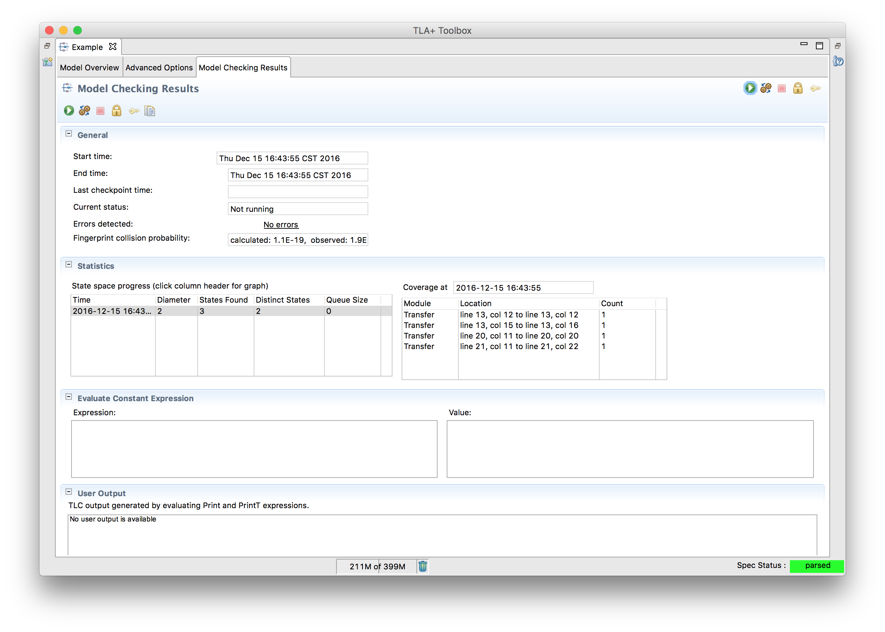
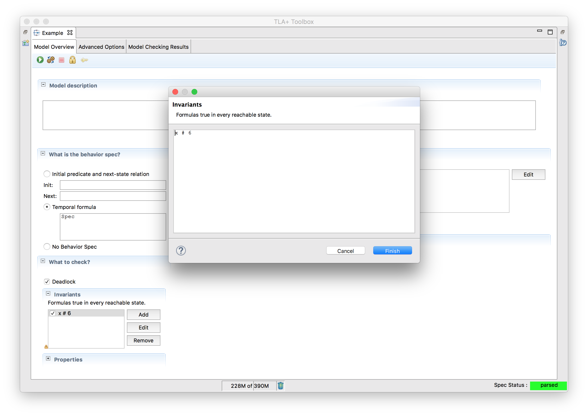

+++
title = "Using the Toolbox"
weight = 3
+++

Our goal with writing specifications is to look for errors in the specification. To do this, we first need to convert our PlusCal code into TLA+, and then tell a model checker what to look for. Both of these can be a little tricky. Fortunately, we have an IDE available called [TLA+ Toolbox](https://research.microsoft.com/en-us/um/people/lamport/tla/toolbox.html). We'll be using the following example as the introduction

``` tla
---- MODULE example ----
EXTENDS Integers

(* --algorithm example
variables x = 5
begin
 Add:
  x := x + 1;
end algorithm; *)
====
```

Create a new spec (remember that the name must match) and copy that in. Run the translator. The first thing you will see that your file was updated with something like this:

```
\* BEGIN TRANSLATION

A WHOLE LOTTA STUFF

\* END TRANSLATION
```

That's the generated TLA+. Probably makes sense now as to why we're starting with PlusCal. Don't worry, we'll be covering TLA+ in depth in the next chapter, but you're not expected to completely understand the entire translation. But that's the actual code we'll be model checking.

Next, we create a _model_, which tells TLC what to check. The section we're interested in is the overview, which should look like this:


Terms:

- **Model Description:** No semantic meaning, just for documentation.
- **What is the behavior spec?:** Out of scope. Just leave this at "Temporal Formula" for now.
- **What is the model?:** We'll cover this in the "Models" chapter.
- **What to check?:** This is the meat of what we care about. 
  - _Deadlock_ checks that the program can't Catch-22 itself. 
  - _Invariants_ check that some equation, for example `x = TRUE`, is true for all possible states TLC can reach.
  - _Temporal Properties_ check that something is true over all possible behaviors, aka "lifetimes". For example, "x switches from TRUE to FALSE and back".
- **How to run?:** Runtime optimizations. This is out of scope.

We can run the model by clicking the green arrow in the top left. TLC will explore the entire state space, looking for possible failures in our invariants. Since we don't actually have any invariants yet, it won't find any failures, so this will be successful. Notice that it lists of the diameter as 2 and the number of distinct states as 2. The former means that the longest interesting progression was two steps long: the initial state where `x = 5` and the `Add` step where `x = 6`. Since there's only one possible starting state, there are 2 distinct states total.



What happens if we change `x = 5` to `x \in 1..5`? Retranslate the algorithm and rerun the model. You'll see that while the diameter is still 2, there are now 10 distinct states. Since there are five potential initial values, TLC will run the model with all of them in case one of them fails the (still nonexistent) invariants.

{}
These numbers are mostly metadata: they don't effect if the spec is valid or not, but it's helpful to look at them if you need to make optimizations.
{}

Let's actually make it fail an invariant, then! Move back to the model overview and add `x /= 6` to the "Invariants" section. This, unsurprisingly, says that a core invariant of our program is that x is never 6. This obviously fails when x is five, which is one of the potential initial states. When we rerun the model, we get something like this:




Not only does this show us what failed, it shows us **how** it failed. In this case, "Initial Predicate" tells us the starting state: x is five. The following "action" line shows that the "Add" step finished and x changed to 6, which invalidates our invariant.

{}
The TLA+ Toolbox maps the F11 key to "Run Model".
{}

## Evaluating Expressions

Switch back to the main overview section. Change the behavior spec to "no behavior spec". This tells TLC that there’s no system you are modelling, and you’re just playing around with the TLA+ syntax. We can’t run anything here. But what we can do is go over to "model checking results" and put TLA in "evaluate constant expression". Try putting in `CHOOSE y \in {1, 2, 3} : y*y = 4` in that box and rerun the model. You should see `2` appear in the "Value" box.

We won’t be using the "no behavior spec" mode for testing actual systems, but it’s a nice tool to test that you understand how some TLA+ expression will work. Don’t worry, we’ll be reintroducing this when we dive into TLA+ proper.
