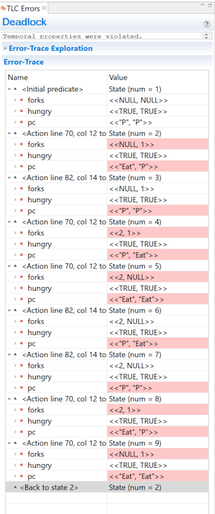

+++
title = "Temporal Operators"
weight = 1
+++

## Liveness

Whenever we write invariants, we're saying "for an arbitrary state, this will never happen." And this has been very useful. But safety only tells us that bad things won't happen. Sometimes, we want to ask a whether good things _do_ happen. Will the trade eventually happen? Does every thread at some point get priority? Does our algorithm _finish_?

We call these properties _Liveness_. To specify these temporal properties, we use a few new operators.

### `[]`

`[]P` means that P is true for all states. In other words, an invariant. When you put `P` in the invariant box, TLC interprets that as the temporal property `[]P`. The only difference is that TLC is hyper-optimized to handle invariants, so the entire invariants box is basically a convenience thing. So while `[]` implicitly powers all of our invariants, we almost never need to write it explicitly.

### `<>`

`<>` means _eventually_: `<>P` means that for every possible behavior, at least one state has P as true. For example, the following code is wrong under the temporal property `<>(x = 1)`

```tla
(* --algorithm example
variables x = 3
begin
  while x > 0 do
  with decrement \in {1, 2} do
    x := x - decrement
  end with;
  end while;
end algorithm; *)
```

There exists one timeline where x never passes through 1: "x = 3 -> x = 2 -> x = 0". So it's not true that 'eventually, x is 1'. As long as every behavior has at least one state satisfying the statement, an eventually is true.

### `~>`

`~>` means _leads to_: `P ~> Q` implies that if P ever becomes true, at some point afterwards Q must be true. For example:

``` tla
(* --algorithm example
variables x = 4, decrement \in {1, 2}
begin
  while x > 0 do
    x := x - decrement
  end while;
end algorithm; *)
```

As with before, `<>(x = 1)` is not true: we can do `4 -> 2 -> 0`. But the temporal property `(x = 3) ~> (x = 1)` **is** true: there's no way to pass through 3 without also passing through 1 (disregarding stuttering).

### `<>[]`

`<>[]` means _stays as_: `<>[]P` says that at some point P becomes true and then **stays** true. If your program terminates, the final state has to have P as true. Note that P can switch between true and false, as long as it eventually becomes permanently true.

## Example

Let's go back to the dining philosopher's algorithm we wrote in the last chapter. Here's what the code looks like with the release:

```tla
fair process philosopher \in 1..NP
variables hungry = TRUE;
begin P:
  while hungry do
    either
     with fork \in AvailableForks(self) do
       forks[fork] := self;
     end with;
    or
     await AvailableForks(self) = {};
     with fork \in HeldForks(self) do
      forks[fork] := NULL;
     end with;
    end either;
    Eat:
      if Cardinality(HeldForks(self)) = 2 then
        hungry := FALSE;
        forks[LeftFork(self)] := NULL ||
        forks[RightFork(self)] := NULL;
      end if;
  end while;
end process;
```

The only change to the code is that we made the process fair, so as to avoid stuttering. We can guarantee in here that the system never deadlocks; at any point, at least one philosopher can do _something_. However, that's not quite enough: can we guarantee that every philosopher finishes eating? Normal invariants aren't enough to model that. But we can do that with a temporal operator:

```tla
<>(\A p \in 1..NP: ~hungry[p])
```

Checks that at some point in every behavior, every philosopher is not hungry. However, this doesn't check they _remain_ not hungry, and if something flips them back, it'd still be a valid spec. We could instead use `<>[]` to get that extra guarantee, but there's no need for that here. If we put that into our temporal properties to check and run the spec, we get a very long error:



Each philosopher can put their fork down and immediately pick it back up again, which prevents anybody else from having two forks. This is a _livelock_. How could we write the algorithm to prevent livelocks? Does your solution scale to three or more philosophers?
