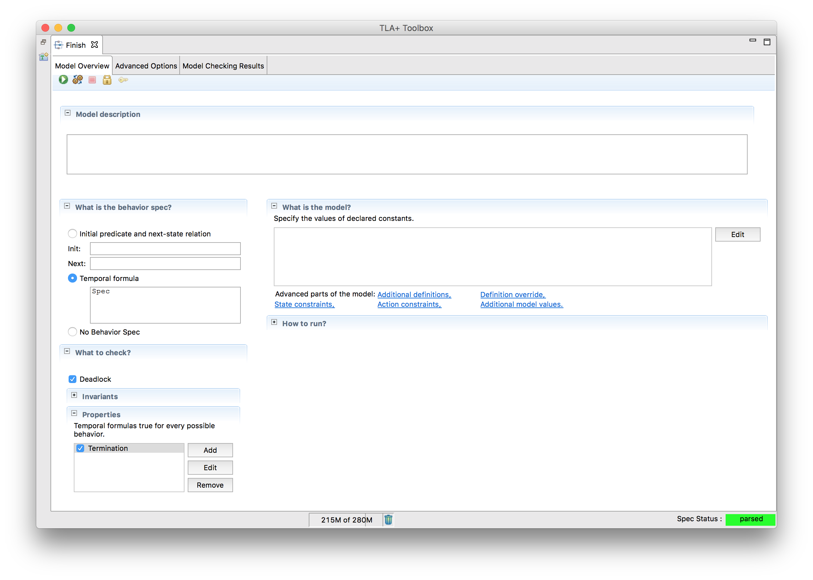
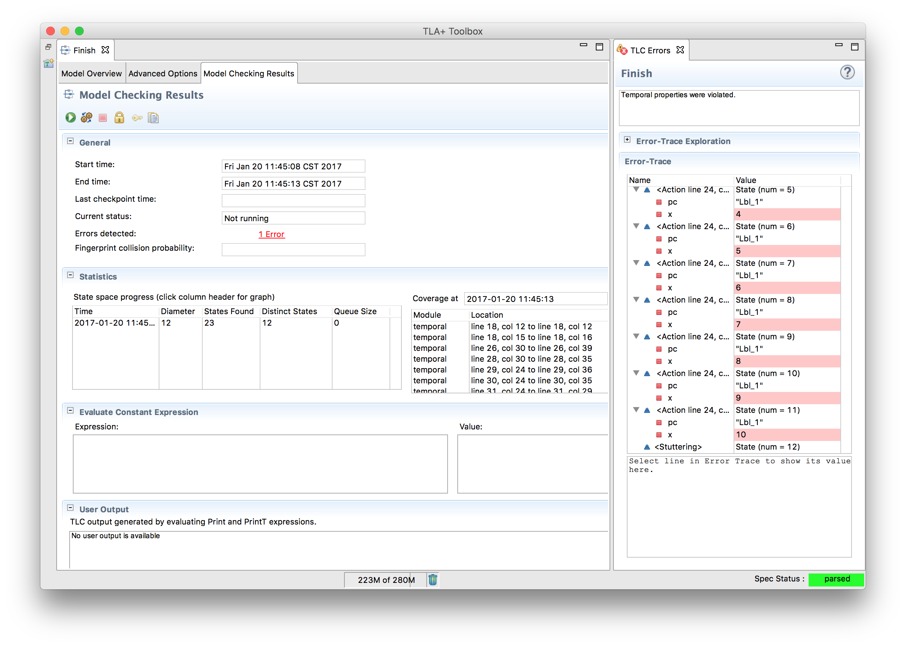

+++
title = "Termination"
weight = 0.5
+++

Will the following PlusCal snippet ever finish?

{}

The most common temporal logic you'll want to check is _Termination_, and TLC provides a handy button to test just that.

This will succeed if, for all behaviors, the spec _ends_. Let's see what happens when we run this:

Well, that was certainly unexpected! This is called _stuttering_. The problem is that the system can choose not to run any step at all. This has never been a problem before because we were making sure things didn't break if time passed, but now things break if time doesn't pass.

How do we get around this? What we want is something called _fairness_: the property that if a given label is always enabled, we will eventually run it. We make this happen by specifying the process as a `fair process`.

{}

Confirm this works as expected.

{}
There's a way to enforce fairness for a single process app, but it's a bit finicky so I'm leaving it out.
{}