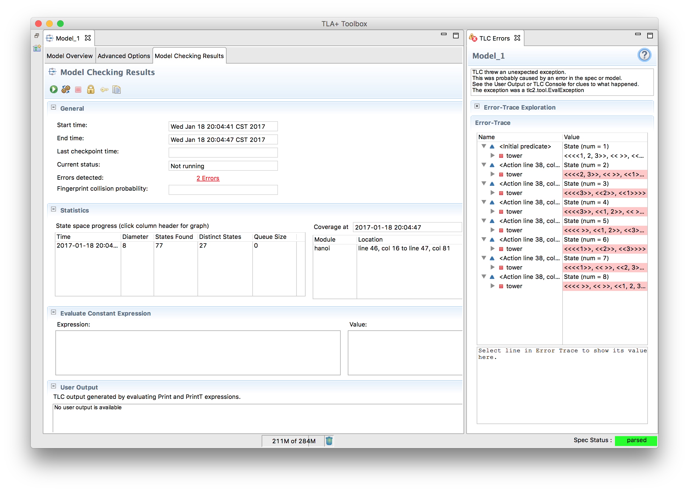

+++
title = "Tuples and Structures"
weight = 3
+++

### Tuples

Tuples are pretty much what you think they are. They have an ordering and everything. You specify them with `<<>>` and they are 1-indexed.

{}
Did I mention they're 1-indexed? They're 1-indexed.
{}

```
x == <<4, 5, 6>>;
x[1] + x[2] + x[3] = 15;
```

In addition, you have the `DOMAIN` operator. `DOMAIN Tuple` is the set `1..Len(Tuple)`. For example, `DOMAIN <<"hello", "world", "!">> = {1, 2, 3}`.

If you add `EXTENDS Sequences` to your spec, they also do double duty as sequences, which adds some more functionality. As with all operators, none of these will mutate the sequence. If you want to pop the head, for example, you have to do `seq := Tail(seq)`.

operator | operation | example
------|-----------|--------
Head | First element | `Head(<<1, 2>>) = 1`
Tail | Sequence aside from head | `Tail(<<1, 2>>) = <<2>>`
Append | Add element to end of sequence | `Append(<<1>>, 2) = <<1, 2>>`
`\o` | Combine two sequences | `<<1>> \o <<2>> = <<1, 2>>`
Len | Length of sequence | `Len(<<1, 2>>) = 2`

Note that these use parenthesis, unlike DOMAIN, SUBSET, and UNION. A very rough rule of thumb is that if it's from a module, it uses parenthesis, and if it's part of the core language, it will be in ALL CAPS.

{}
If the value is undefined (for example, `Tail(<<>>)`), the model considers that an error in your spec. And let's be honest, it probably is.
{}

{}
Write an operator that takes a tuple and, if the tuple is length two, returns the reversed tuple, and otherwise returns the original tuple.

{}
```
Reverse(Twople) == IF Len(Twople) = 2 THEN <<Twople[2], Twople[1]>> ELSE Twople
```
{}
{}

#### Sets of Tuples

Sometimes, you need a set of tuples or sequences. For example, given a chessboard, you might represent the squares as a pair of two integers. The construct, then, for every possible point in the grid would be `(1..8) \X (1..8)`. `\X` here is the _Cartesian product_ operator: `set1 \X set2` is the set of all tuples `t` where `t[1] \in set1` and `t[2] \in set2`.

```
chessboard_squares == {"a", "b", "c", "d", "e", "f", "g", "h"} \X (1..8)
<<"a", 2>> \in chessboard_squares
<<2, "a">> \notin chessboard_squares
<<"b", 10>> \notin chessboard_squares
```

You can combine more than two sets with `\X`, but how they combine depends on how you group the sets. Given `a \in A`, `b \in B`, and `c \in C`:

```
<<a, b, c>> \in A \X B \X C
<<<<a, b>>, c>> \in (A \X B) \X C
<<a, <<b, c>>>> \in A \X (B \X C)
```

The first is a tuple of length three, the latter two are tuples of length two, one element of which is a tuple of length two.

### Structures

Structures are hashes. They have keys and values. You specify them as `[key |-> value]` and query them with either `["key"]` or `.key`. Both are legal and valid.

```
x = [a |-> 1, b |-> {2, 3}];
x.a = 1;
x["b"] = {2, 3};
```

Aside from that, there's one extra trick structures have. Instead of `key |-> value`, you can do `key : set`. In that case, instead of a structure you get the set of all structures which have, for each given key, a value in the set.

```
x = [a : {1}, b : {2, 3}];
x = { [a |-> 1, b |-> 2], [a |-> 1, b -> 3] }
```

You can also use `DOMAIN` on structures, which will give the set of keys, as strings.

{}
If you use `:` syntax and _any_ of the values are not sets, then the entire construct is invalid. In other words, while `[a: {1}, b: {2,3}]` is the above set, `[a: 1, b: {2, 3}]` will throw an error if you try to use it.
{}

### Type Composition

Any type can be squeezed inside any other type.

```
x = [a |-> {<<>>, <<1, 2, 3>>, <<3, 2, 1>>}, b |-> <<[a |-> 0]>>];
x.b[1].a; \* 0
```

There's nothing technically _stopping_ you from writing a sequence with alternating 1's and sets of structures, but that will end very badly, so please don't do that.

## Example

_Solve the Tower of Hanoi._

This kind of problem flips TLA+ on its head. Instead of checking if our solution has no problems, we're checking that our problem has a solution! A common way to do this is to turn the spec inside out: we say the spec is "valid" if the solution is unreachable. Then TLC will flag it as an "error" and show us the steps required to reproduce the solution.

{}

Everything should look familiar with the exception of the set syntax we use to define "from" and "to". We're covering that in more detail next section, but for now, it's roughly a set filter. For example, `from` is defined as being one of the numbers such that that tower has at least one element in it.

For `to`, we pull it from a more restricted set: We either want the tower to be empty, or have a bigger top stone than the tower we're moving from. Finally, in the block itself, we simulate a move with `Tail` and concatting. The concat is a bit of a hack, actually- while it seems like `Append` would be the appropriate operator here, it would put it at the wrong end of the sequence. For example, `Append(<<2, 1>>, 3) = <<2, 1, 3>>`, when we actually want `<<3, 2, 1>>`.



Running this model throws an 'error' and shows the steps required to reproduce the bug, aka find the solution. In general, TLA+ isn't that well suited for solving constraint problems like these, but it can be used to do so in a pinch. Another common example is using TLA+ to solve the [water bucket puzzle](https://github.com/tlaplus/Examples/tree/master/specifications/DieHard).
